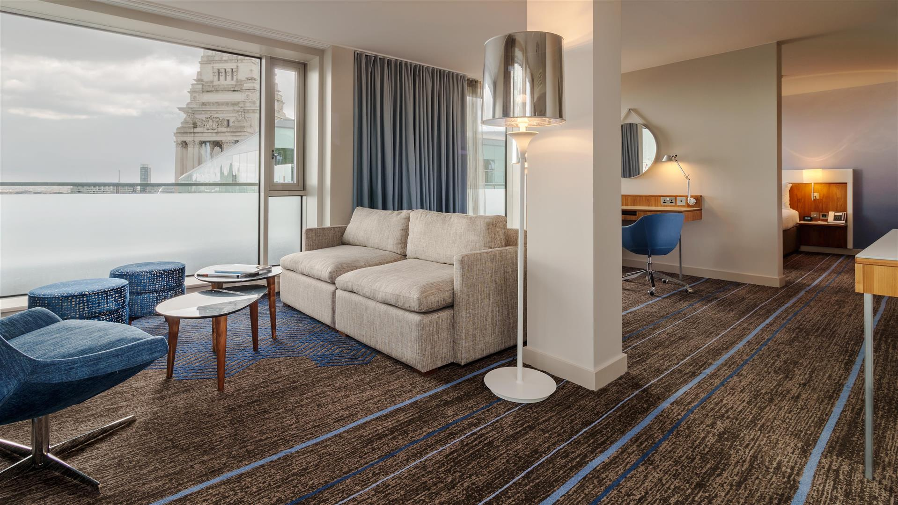

```{r setup, include=FALSE}
library(tidyverse)
library(plotly)
knitr::opts_chunk$set(
echo = TRUE,
warning = FALSE,
fig.width = 9, 
  fig.height = 9,
  out.width = "80%"
)
options(
  ggplot2.continuous.colour = "viridis",
  ggplot2.continuous.fill = "viridis"
)
scale_colour_discrete = scale_colour_viridis_d
scale_fill_discrete = scale_fill_viridis_d
theme_set(theme_minimal() + theme(legend.position = "bottom"))
```

\
_image source: google_


```{r include=FALSE}
# data import 
hotel_df = read.csv("./data/hotel_bookings.csv",na = c("", "NA", "NULL")) 

hotel_ml = 
  hotel_df %>% 
  filter(arrival_date_year==2016) %>%
  mutate(
    arrival_season = case_when(
      arrival_date_month %in% c("October","November","December") ~ "Fall",
      arrival_date_month %in% c("January","February","March") ~ "Winter",
      arrival_date_month %in% c("April","May","June") ~ "Spring",
      TRUE ~ "Summer"
    ),
    false_room_assignment = case_when(
      reserved_room_type == assigned_room_type ~ "0",
      reserved_room_type != assigned_room_type ~ "1"
    ),
    false_room_assignment = as.factor(false_room_assignment),
    is_canceled = as.factor(is_canceled)) %>% 
    select(lead_time,total_of_special_requests,agent,previous_cancellations,adr,booking_changes,arrival_date_month,arrival_season,meal,market_segment,distribution_channel,reserved_room_type,deposit_type,customer_type) %>% 
  mutate_if(is.character, as.factor)

##write hotel_ml.csv
write.csv(hotel_ml,"./data/hotel_ml.csv")

```


